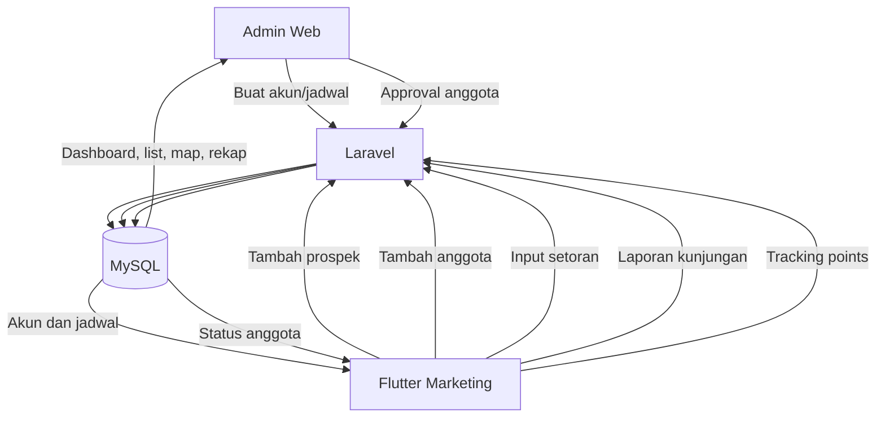
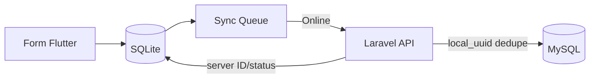

# Alur data utama

```mermaid
flowchart TD
    Admin[Admin Web] -->|Buat akun/jadwal| Laravel
    Laravel --> DB[(MySQL)]
    DB -->|Akun dan jadwal| Flutter[Flutter Marketing]
    Flutter -->|Tambah prospek| Laravel
    Flutter -->|Tambah anggota| Laravel
    Flutter -->|Input setoran| Laravel
    Flutter -->|Laporan kunjungan| Laravel
    Flutter -->|Tracking points| Laravel
    Laravel --> DB
    DB -->|Dashboard, list, map, rekap| Admin
    Admin -->|Approval anggota| Laravel
    Laravel --> DB
    DB -->|Status anggota| Flutter
```

# Offline

```mermaid
flowchart LR
    Form[Form Flutter] --> SQLite[(SQLite)]
    SQLite --> Queue[Sync Queue]
    Queue -->|Online| API[Laravel API]
    API -->|local_uuid dedupe| DB[(MySQL)]
    API -->|server ID/status| SQLite
```
