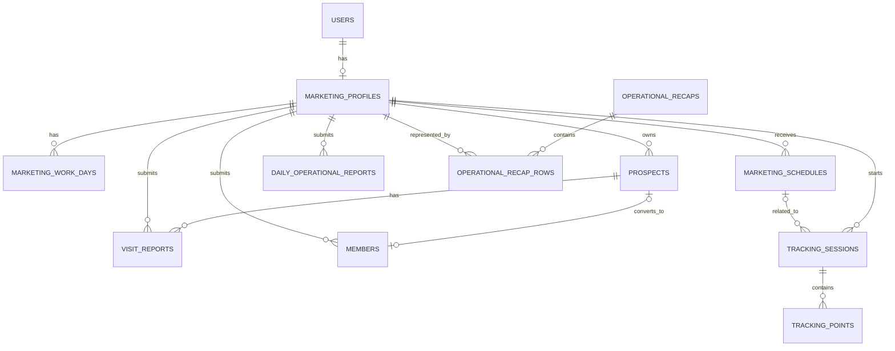

# ERD

```mermaid
erDiagram
    USERS ||--o| MARKETING_PROFILES : has
    MARKETING_PROFILES ||--o{ MARKETING_WORK_DAYS : has
    MARKETING_PROFILES ||--o{ MARKETING_SCHEDULES : receives
    MARKETING_PROFILES ||--o{ PROSPECTS : owns
    PROSPECTS ||--o{ VISIT_REPORTS : has
    PROSPECTS o|--o| MEMBERS : converts_to
    MARKETING_PROFILES ||--o{ MEMBERS : submits
    MARKETING_PROFILES ||--o{ DAILY_OPERATIONAL_REPORTS : submits
    MARKETING_PROFILES ||--o{ VISIT_REPORTS : submits
    MARKETING_PROFILES ||--o{ TRACKING_SESSIONS : starts
    TRACKING_SESSIONS ||--o{ TRACKING_POINTS : contains
    OPERATIONAL_RECAPS ||--o{ OPERATIONAL_RECAP_ROWS : contains
    MARKETING_PROFILES ||--o{ OPERATIONAL_RECAP_ROWS : represented_by
    MARKETING_SCHEDULES o|--o{ TRACKING_SESSIONS : related_to
```

Detail kolom berada pada `07_DATABASE_SCHEMA.md`.
