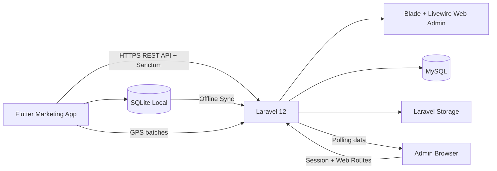

# Arsitektur sistem

# Boundary

- Flutter dan Laravel adalah dua project.
- Backend, API, dan web admin adalah satu project Laravel.
- MySQL hanya diakses Laravel.
- SQLite hanya berada di perangkat Flutter.
